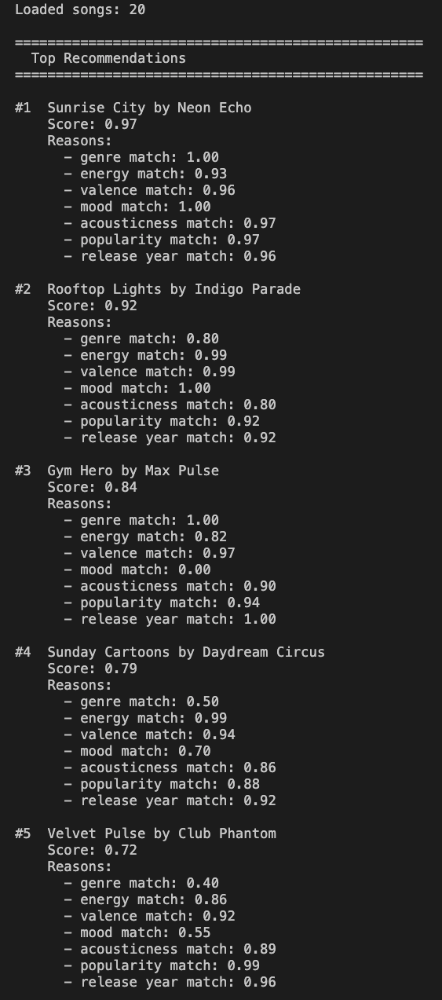

# 🎵 Music Recommender Simulation

## Project Summary

In this project you will build and explain a small music recommender system.

Your goal is to:

- Represent songs and a user "taste profile" as data
- Design a scoring rule that turns that data into recommendations
- Evaluate what your system gets right and wrong
- Reflect on how this mirrors real world AI recommenders

Replace this paragraph with your own summary of what your version does.

---

## How The System Works
Real-world recommenders like Spotify and YouTube predict what users will enjoy by combining two strategies: collaborative filtering, which surfaces content based on patterns across millions of users, and content-based filtering, which matches content to a user based on the item's own measurable attributes. My version of Music Recommender Simulation focuses entirely on content-based filtering. This version will prioritize genre as the most stable and decisive signal of a user's taste, energy level to match the listener's activity context, and valence to reflect the emotional tone a user is seeking — making every recommendation fully explainable from the song's own features rather than relying on what other users listened to.

### Sample Output



### Plan
We score every song in the catalog against the user profile using a weighted additive formula. Genre and mood use partial-credit lookup tables so related genres and moods get meaningful scores instead of zero. Numeric features like energy and valence use linear proximity — the closer the song's value is to the user's target, the higher the score. All 7 component scores are multiplied by their weights and summed to a final score in [0.0, 1.0]. Songs are then ranked descending by score, with ties broken by song id, and the top-k are returned.

### Algorithm Recipe
- `score = (genre_score × 0.30) + (energy_score × 0.25) + (valence_score × 0.20) + (mood_score × 0.10) + (acousticness_score × 0.05) + (popularity_score × 0.05) + (release_year_score × 0.05)`
- All weights sum to 1.0. All component scores are in [0.0, 1.0]. Final score is in [0.0, 1.0].
- Genre and mood use lookup tables with partial credit for related genres and moods — a lofi fan gets partial credit for an ambient song rather than zero.
- Numeric features (energy, valence, acousticness, popularity, release year) use linear proximity: `1.0 - abs(song_value - target_value)`.
- Songs are ranked descending by score. Ties are broken by song id (ascending).
- The top-k songs are returned.

### Known Biases
- This system may over-prioritize genre, causing it to miss great songs that match the user's mood and energy but belong to a slightly different genre.
- A user with niche preferences (e.g. favorite_genre = "world") may receive lower scores across the board if few songs in the catalog match — the system has no way to relax constraints when the catalog is small.
- The valence target is inferred from mood label via a fixed lookup table. If a user's actual emotional expectation differs from the table's assumed mapping, valence scores will be systematically off.
- Tiebreaker by id favors lower-numbered (earlier-added) songs, which could unintentionally bias results toward older catalog entries.

### Song Features
- `id` — unique identifier, used for tie-breaking in ranking
- `title` — song name, used for display
- `artist` — performer name, used for display
- `genre` — musical genre, used in scoring (weight: 0.30)
- `mood` — emotional character, used in scoring (weight: 0.10)
- `energy` — intensity level 0.0–1.0, used in scoring (weight: 0.25)
- `tempo_bpm` — beats per minute, stored but not used in scoring
- `valence` — musical positiveness 0.0–1.0, used in scoring (weight: 0.20)
- `danceability` — rhythmic suitability 0.0–1.0, stored but not used in scoring
- `acousticness` — acoustic vs. electronic 0.0–1.0, used in scoring (weight: 0.05)
- `popularity` — popularity score 0–100, used in scoring (weight: 0.05)
- `release_year` — year of release, used in scoring (weight: 0.05)

### UserProfile Features
- `favorite_genre` — preferred genre, matched against `song.genre`
- `favorite_mood` — preferred mood, matched against `song.mood` and used to infer valence target
- `target_energy` — preferred energy level 0.0–1.0, compared to `song.energy`
- `likes_acoustic` — boolean preference, converted to float target for `song.acousticness`
- `likes_mainstream` — boolean preference, converted to float target for `song.popularity`
- `prefers_recent` — boolean preference, sets target year for `song.release_year`

---

## Getting Started

### Setup

1. Create a virtual environment (optional but recommended):

   ```bash
   python -m venv .venv
   source .venv/bin/activate      # Mac or Linux
   .venv\Scripts\activate         # Windows

2. Install dependencies

```bash
pip install -r requirements.txt
```

3. Run the app:

```bash
python -m src.main
```

### Running Tests

Run the starter tests with:

```bash
pytest
```

You can add more tests in `tests/test_recommender.py`.

---

## Experiments You Tried

Use this section to document the experiments you ran. For example:

- What happened when you changed the weight on genre from 2.0 to 0.5
- What happened when you added tempo or valence to the score
- How did your system behave for different types of users

---

## Limitations and Risks

Summarize some limitations of your recommender.

Examples:

- It only works on a tiny catalog
- It does not understand lyrics or language
- It might over favor one genre or mood

You will go deeper on this in your model card.

---

## Reflection

Read and complete `model_card.md`:

[**Model Card**](model_card.md)

Write 1 to 2 paragraphs here about what you learned:

- about how recommenders turn data into predictions
- about where bias or unfairness could show up in systems like this


---

## 7. `model_card_template.md`

Combines reflection and model card framing from the Module 3 guidance. :contentReference[oaicite:2]{index=2}  

```markdown
# 🎧 Model Card - Music Recommender Simulation

## 1. Model Name

Give your recommender a name, for example:

> VibeFinder 1.0

---

## 2. Intended Use

- What is this system trying to do
- Who is it for

Example:

> This model suggests 3 to 5 songs from a small catalog based on a user's preferred genre, mood, and energy level. It is for classroom exploration only, not for real users.

---

## 3. How It Works (Short Explanation)

Describe your scoring logic in plain language.

- What features of each song does it consider
- What information about the user does it use
- How does it turn those into a number

Try to avoid code in this section, treat it like an explanation to a non programmer.

---

## 4. Data

Describe your dataset.

- How many songs are in `data/songs.csv`
- Did you add or remove any songs
- What kinds of genres or moods are represented
- Whose taste does this data mostly reflect

---

## 5. Strengths

Where does your recommender work well

You can think about:
- Situations where the top results "felt right"
- Particular user profiles it served well
- Simplicity or transparency benefits

---

## 6. Limitations and Bias

Where does your recommender struggle

Some prompts:
- Does it ignore some genres or moods
- Does it treat all users as if they have the same taste shape
- Is it biased toward high energy or one genre by default
- How could this be unfair if used in a real product

---

## 7. Evaluation

How did you check your system

Examples:
- You tried multiple user profiles and wrote down whether the results matched your expectations
- You compared your simulation to what a real app like Spotify or YouTube tends to recommend
- You wrote tests for your scoring logic

You do not need a numeric metric, but if you used one, explain what it measures.

---

## 8. Future Work

If you had more time, how would you improve this recommender

Examples:

- Add support for multiple users and "group vibe" recommendations
- Balance diversity of songs instead of always picking the closest match
- Use more features, like tempo ranges or lyric themes

---

## 9. Personal Reflection

A few sentences about what you learned:

- What surprised you about how your system behaved
- How did building this change how you think about real music recommenders
- Where do you think human judgment still matters, even if the model seems "smart"

